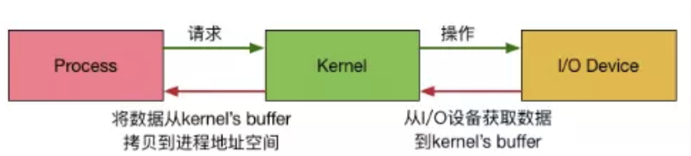
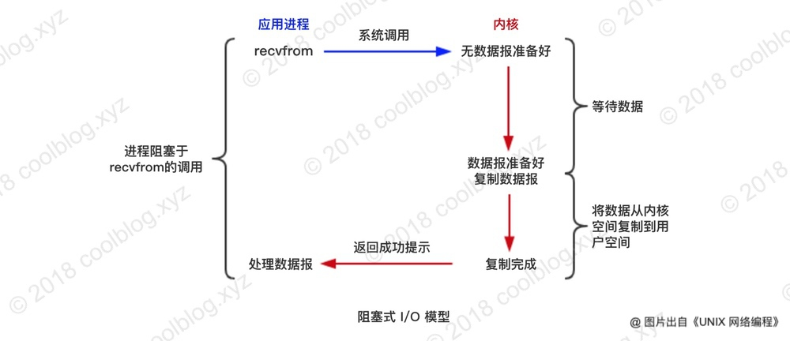
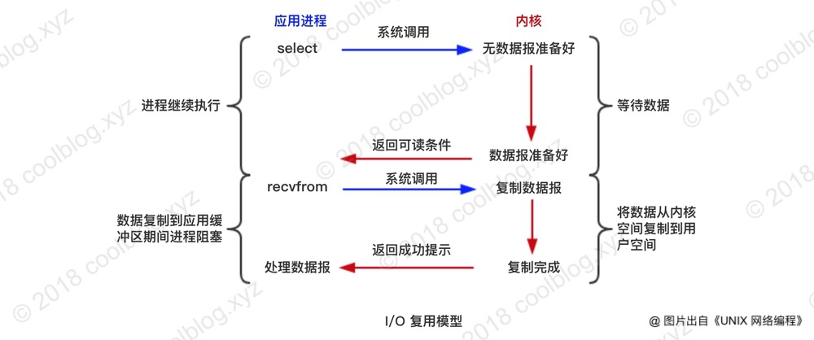
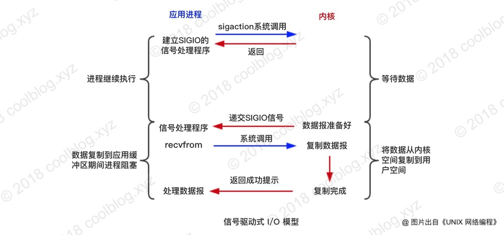
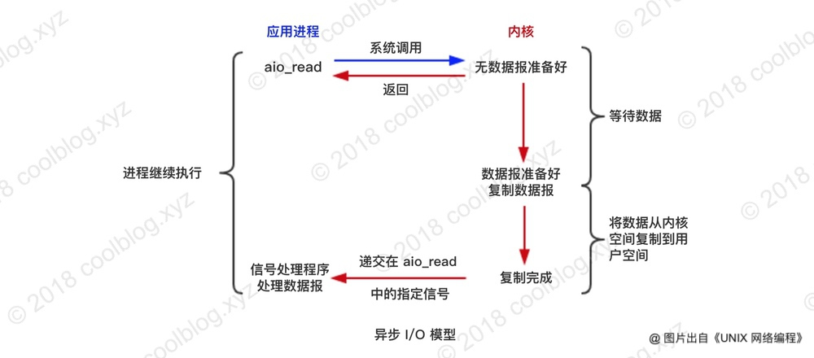
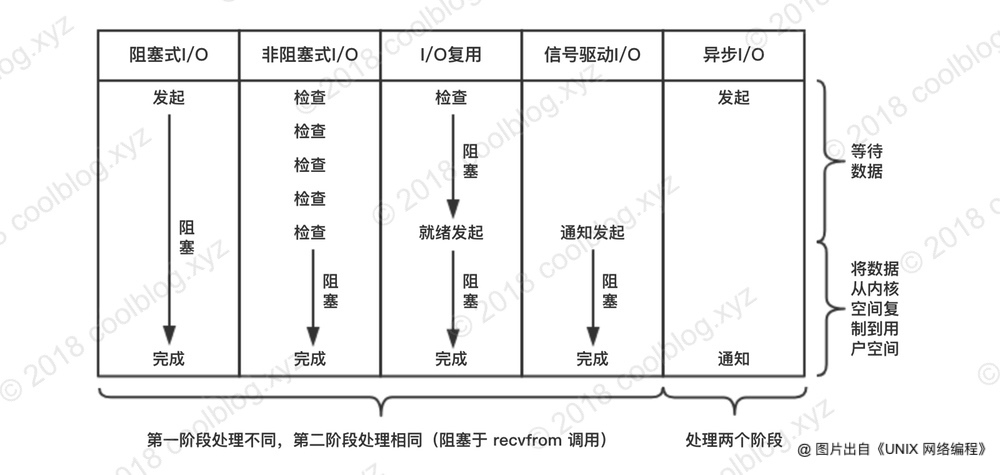
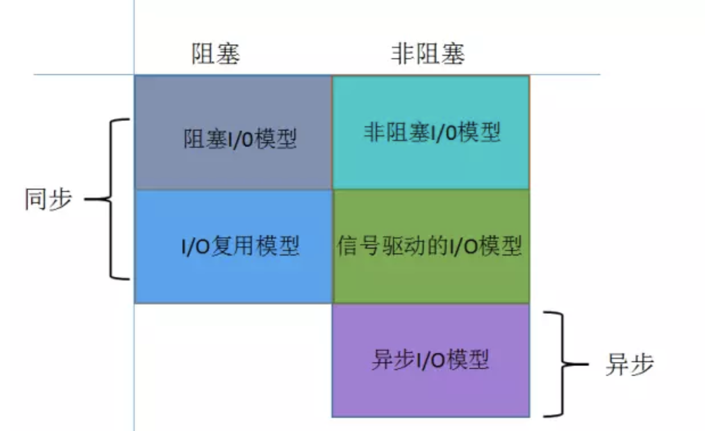

# IO/NIO

## 应用进程和内核的关系
**内核**即操作系统内核，用于控制计算机硬件。同时将用户态的程序和底层硬件隔离开，以保障整个计算机系统的稳定运转（如果用户态的程序可以控制底层硬件，那么一些病毒就会针对硬件进行破坏，比如 CIH 病毒）。

**应用进程**即用户态进程，运行于操作系统之上，通过系统调用与操作系统进行交互。上图中，内核指的是 TCP/IP 等协议及相关驱动程序。客户端发送的请求，并不是直接送达给应用程序，而是要先经过内核。内核将请求数据缓存在内核空间，应用进程通过 recvfrom 调用，将数据从内核空间拷贝到自己的进程空间内。

整个请求过程为： 用户进程发起请求，内核接受到请求后，从I/O设备中获取数据到buffer中，再将buffer中的数据copy到用户进程的地址空间，该用户进程获取到数据后再响应客户端。

## 5种IO模型
`recvfrom`函数 : 经socket接收数据

### 1.阻塞I/O (Blocking I/O)

应用进程通过系统调用 recvfrom 接收数据，但由于内核还未准备好数据报，应用进程就阻塞住了。直到内核准备好数据报，recvfrom 完成数据报复制工作，应用进程才能结束阻塞状态。

### 2.非阻塞I/O (Non-Blocking I/O)

与阻塞 I/O 模型相反，在非阻塞 I/O 模型下。应用进程与内核交互，目的未达到时，不再一味的等着，而是直接返回。然后通过轮询的方式，不停的去问内核数据准备好没。应用进程进入轮询状态时等同于阻塞，所以非阻塞的 I/O 似乎并没有提高进程工作效率。

### 3.I/O复用（I/O Multiplexing)

Unix/Linux 环境下的 I/O 复用模型包含三组系统调用，分别是 select、poll 和 epoll

#### 基本原理

基本原理就是select/epoll会不断的轮询所负责的所有socket，当某个socket有数据到达了，就通知用户进程。

#### select

select` 有三个文件描述符集，分别是可读文件描述符集`readfds`、可写文件描述符集`writefds`和异常文件描述符集`exceptfds`。应用程序可将某个 socket （文件描述符）设置到感兴趣的文件描述符集中，并调用 `select `等待所感兴趣的事件发生。比如某个 socket 处于可读状态了，此时应用进程就可调用 recvfrom 函数把数据从内核空间拷贝到进程空间内，无需再等待内核准备数据了。调用后select函数会阻塞，直到有描述符就绪（有数据可读、可写、或者有except），或者超时（timeout指定等待时间，如果立即返回设为null即可），函数返回。

#### poll

poll本质上和select没有区别，它将用户传入的数组拷贝到内核空间，然后查询每个fd对应的设备状态，如果设备就绪则在设备等待队列中加入一项并继续遍历，如果遍历完所有fd后没有发现就绪设备，则挂起当前进程，直到设备就绪或者主动超时，被唤醒后它又要再次遍历fd。这个过程经历了多次无谓的遍历。

#### epoll

相对于select和poll来说，epoll更加灵活，没有描述符限制。epoll使用一个文件描述符管理多个描述符，将用户关系的文件描述符的事件存放到内核的一个事件表中，这样在用户空间和内核空间的copy只需一次。

epoll支持水平触发和边缘触发，最大的特点在于边缘触发，它只告诉进程哪些fd刚刚变为就绪态，并且只会通知一次。还有一个特点是，epoll使用“事件”的就绪通知方式，通过epollctl注册fd，一旦该fd就绪，内核就会采用类似callback的回调机制来激活该fd，epollwait便可以收到通知。

一般情况下，应用进程会将多个 socket 设置到感兴趣的文件描述符集中，并调用` select` 等待所关注的事件（比如可读、可写）处于就绪状态。当某些 socket 处于就绪状态后，`select `返回处于就绪状态的 **sockct 数量**。注意这里返回的是 socket 的数量，并不是具体的 socket。应用程序需要自己去确定哪些 socket 处于就绪状态了，确定之后即可进行后续操作。

### 4.信号驱动的I/O (Signal Driven I/O)

应用进程告诉内核，如果某个 socket 的某个事件发生时，请向我发一个信号。在收到信号后，信号对应的处理函数会进行后续处理。

用户进程不是阻塞的。首先用户进程建立SIGIO信号处理程序，并通过系统调用sigaction执行一个信号处理函数，这时用户进程便可以做其他的事了，一旦数据准备好，系统便为该进程生成一个SIGIO信号，去通知它数据已经准备好了，于是用户进程便调用recvfrom把数据从内核拷贝出来，并返回结果。

### 5.异步I/O

应用进程把文件描述符传给内核后，啥都不管了，完全由内核去操作这个文件描述符。内核完成相关操作后，会发信号告诉应用进程，某某 I/O 操作我完成了，你现在可以进行后续操作了。

与信号驱动IO模型的主要**区别**是：在信号驱动的I/O中，内核告诉我们何时可以启动I/O操作，但是异步I/O时，内核告诉我们何时I/O操作完成。

### 总结

## NIO

### NIO VS IO

- IO是面向流的，NIO是面向缓冲区的。
- IO的各种流是阻塞的。这意味着，当一个线程调用read() 或 write()时，该线程被阻塞； NIO的非阻塞模式，使一个线程从某通道发送请求读取数据，但是它仅能得到目前可用的数据，如果目前没有数据可用时，就什么都不会获取。而不是保持线程阻塞，所以直至数据变得可以读取之前，该线程可以继续做其他的事情。 

### Channel

### Buffer

缓冲区，实际上是一个容器，一个连续数组。

### Selector

Selector运行单线程处理多个Channel，如果你的应用打开了多个通道，但每个连接的流量都很低，使用Selector就会很方便。

