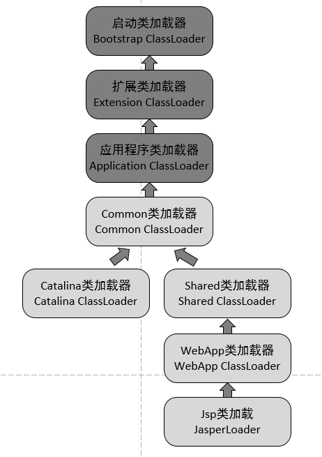

# 启动

## BootStrap
- 创建3个类加载器：`commonLoader`、`catalinaLoader`、`sharedLoader`
- 实例化`Catalina`对象

## 类加载器
需要解决的问题
- 一个web容器可能需要部署两个应用程序，不同的应用程序可能会依赖同一个第三方类库的不同版本，不能要求同一个类库在同一个服务器只有一份，因此要保证每个应用程序的类库都是独立的，保证相互隔离。
- 部署在同一个web容器中相同的类库相同的版本可以共享。否则，如果服务器有10个应用程序，那么要有10份相同的类库加载进虚拟机，这是扯淡的。
- web容器也有自己依赖的类库，不能于应用程序的类库混淆。基于安全考虑，应该让容器的类库和程序的类库隔离开来。
- web容器要支持jsp的修改，我们知道，jsp 文件最终也是要编译成class文件才能在虚拟机中运行，但程序运行后修改jsp已经是司空见惯的事情，否则要你何用？ 所以，web容器需要支持 jsp 修改后不用重启。

- `CommonLoader`：Tomcat最基本的类加载器，加载路径中的class可以被Tomcat容器本身以及各个Webapp访问；
- `CatalinaLoader`：Tomcat容器私有的类加载器，加载路径中的class对于Webapp不可见；
- `SharedLoader`：各个Webapp共享的类加载器，加载路径中的class对于所有Webapp可见，但是对于Tomcat容器不可见；
- `WebappClassLoader`：各个Webapp私有的类加载器，加载路径中的class只对当前Webapp可见;
- `JasperLoader`:加载范围仅仅是这个JSP文件所编译出来的那一个.Class文件，它出现的目的就是为了被丢弃：当Web容器检测到JSP文件被修改时，会替换掉目前的JasperLoader的实例，并通过再建立一个新的Jsp类加载器来实现JSP文件的HotSwap功能。

