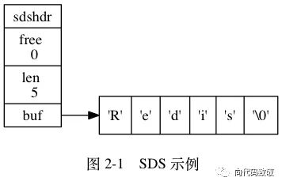

# Redis速度快的原因
- 纯内存操作，内存的读写速度非常快
- 单线程，省去了很多上下文切换线程的时间
- 采用IO多路复用
- 高效的数据结构
- 合理的数据编码
- 其他方面的优化

### 单线程

```
Redis是基于内存的操作，CPU不是Redis的瓶颈，Redis的瓶颈最有可能是机器内存的大小或者网络带宽。既然单线程容易实现，而且CPU不会成为瓶颈，那就顺理成章地采用单线程的方案了。
```

- 省去锁的性能消耗

  单线程的情况下，就不用去考虑各种锁的问题，不存在加锁释放锁操作，也不存在死锁等问题。

- 单线程多进程集群方案

- CPU消耗

  采用单线程，避免了不必要的上下文切换和竞争条件，也不存在多进程或者多线程导致的切换而消耗 CPU。如果不想让服务器的CUP核闲置，可以考虑多起几个Redis进程。

- 代码更清晰，处理逻辑更简单

### IO多路复用

Redis采用网络IO多路复用技术来保证在多连接的时候，系统的高吞吐量。

**多路**指的是多个socket连接，多个网络连接

**复用**指的是复用同一个线程。使用了单线程来轮询描述符，将数据库的开、关、读、写都转换成了事件，减少了线程切换时上下文的切换和竞争。

多路复用主要有三种技术：select，poll，epoll。epoll是最新的也是目前最好的多路复用术。

采用IO多路复用可以让单个线程高效的处理多个连接请求（尽量减少网络IO的时间消耗），且Redis在内存中操作数据的速度非常快（内存内的操作不会成为这里的性能瓶颈），主要以上两点造就了Redis具有很高的吞吐量。

### 数据结构
- `String`：缓存、计数器、分布式锁等。
- `List`：链表、队列、微博关注人时间轴列表等。
- `Hash`：用户信息、Hash 表等。
- `Set`：去重、赞、踩、共同好友等。
- `Zset`：访问量排行榜、点击量排行榜等。

#### SDS



```c
struct sdshdr {
    int len;		//用于记录 buf 中已使用空间的长度
    int free;		//buf 中空闲空间的长度
    char buf[];		//存储实际内容
}
```

